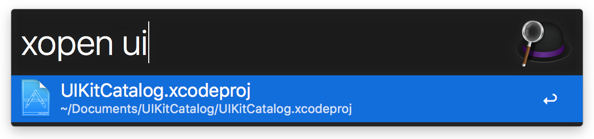

# alfred-xopen 

> [Alfred 3](https://www.alfredapp.com) workflow to open Xcode projects, workspaces, and playgrounds using xopen




## Install

```
$ npm install --global alfred-xopen
```


*Requires the Alfred [Powerpack](https://www.alfredapp.com/powerpack/).*
*Requires that [xopen](https://github.com/paulomendes/xopen) is installed.*

## Usage

In Alfred, type `xopen`, press <kbd>Enter</kbd>, and then start writing a Xcode project name. If you select the `.xcodeproj` but a `.xcworkspace` is avaliable the workspace will be opened so you don't have to worry!


## Tip

The theme in the screenshot is [alfred-simple](https://github.com/sindresorhus/alfred-simple).


## Related

- [alfred-xcode](https://github.com/sindresorhus/alfred-xcode) - Alfred 3 workflow to open Xcode projects, workspaces, and playgrounds
- [alfred-dark-mode](https://github.com/sindresorhus/alfred-dark-mode) - Toggle the system dark mode
- [alfred-npms](https://github.com/sindresorhus/alfred-npms) - Search for npm packages with npms.io
- [alfy](https://github.com/sindresorhus/alfy) - Create Alfred workflows with ease

## Special Thanks
- [Sindre Sorhus](https://github.com/sindresorhus) for making [alfred-xcode](https://github.com/sindresorhus/alfred-xcode)
- [Paulo Mendes](https://github.com/paulomendes) for making [xopen](https://github.com/paulomendes/xopen) - The ultimate word in Xcode project opening!


## License

MIT © [Francesco Perrotti-Garcia](https://github.com/fpg1503)